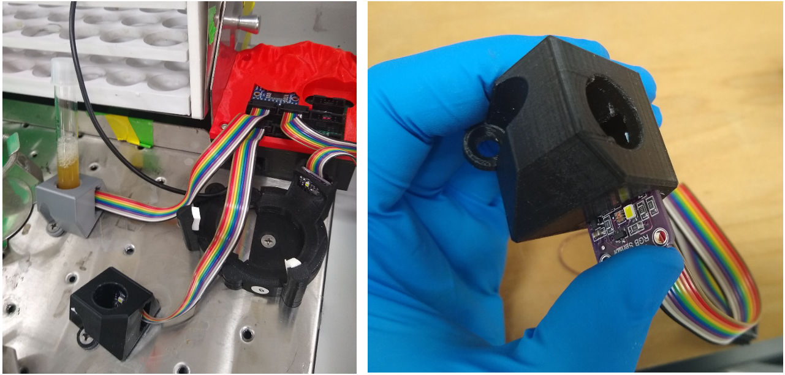
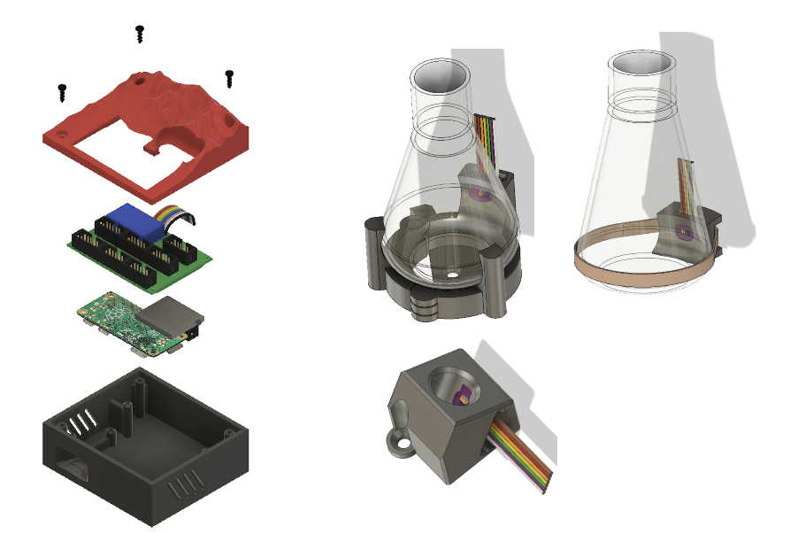
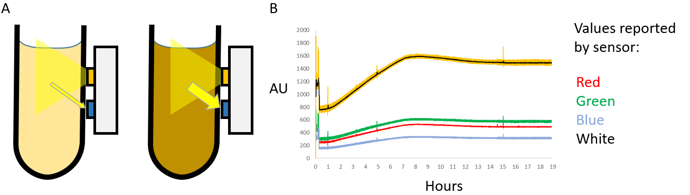

# biomassSensorPy

   

a biomass sensor that utilizes the adafruit RGB color sensor https://www.adafruit.com/product/1334 as a way to detect if bacteria are growing in a flask.

## Physical Design

   
   
The system consists of two basic components:
1. Raspberry pi-containing box that reads the sensors and hosts a webpage for looking at their data output
    - this box contains an i2c multiplexer that allows the use of seven sensors at the same time.
2. The sensor peripheral, which is attached to your culture vessel
    - different sesnor holders have been designed and 3d printed to accomodate different culture vessels.
    - sensor holders can be designed fairly easily, as they are often made of one solid piece with the sensor being slotted and friction fit in place.

## How it works

   
 __A.__ The sensor detects the reflected light change as a culture goes from being transparent to opaque. When the culture is transparent, light from the LED on the sensor goes through the liquid and doesn't reflect back onto the sensor, which means that the sensor basically detects the same amount of light with or without the LED on. Then, when the bacteria grow they become opaque, which reflects the light from the LED back into the sensor, and the reported raw values with the LED on are higher than with the LED off. __B.__ An example trace which shows all the values reported by the sensor. Values reported from the sensor are subtracted from a "no LED" value measured immediately before with the LED off. The sensor detects red, green, blue, and white light reflected by the object placed in front of it. Becuase the change in the "white" value was the highest, this is the only value that is reported in the web interface.
 
### Advantages over conventional OD measurements

- The device reports live culture growth values so there is no need to open the culture vessel and pipet out liquid in order to check the absorbance.
- Values can be checked remotely over the internet which allows remote monitoring of culture growth.
- Many different culture vessels can be used, which means it may be possible to measure the growth conditions in various different culture vessels that would be labor intensive to do, if you have to take out OD samples every data point.
- Growth phases can be visualized without any specific calibration, since you can look at the shape of the growth curve easily.
- device can be used inside a shaking incubator

### Disadvantages over conventional OD measurements

- The values that the sensor reports depend on the tube holder configuration, culture vessel, and amount of liquid in the vessel. You must establish a calibration curve if you want a raw value to OD conversion
- The device connects to a wifi network to report data. If you do not have access to a non-enterprise 2.4 Ghz wifi network, you cannot use the sensor.
- incorrect placement of culture vessels (not right up against the LED of the sensor) can make a big difference on the magnitude of raw values reported.
- only seven tubes can be used at once
- stopping the incubator shaking or walking behind the sensor can create artifacts in the data.
